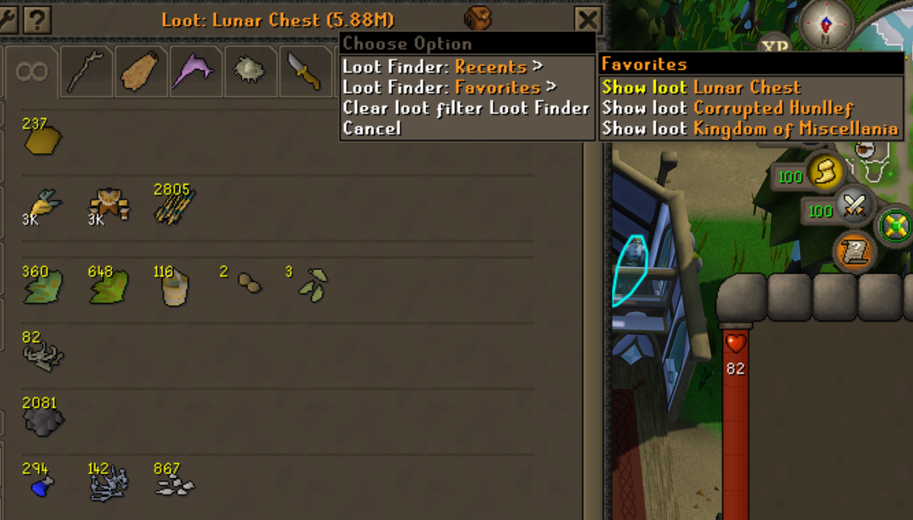
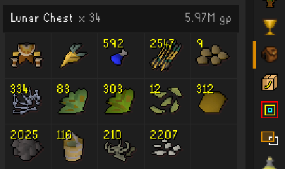
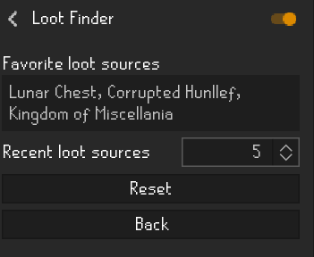

# Loot Finder

Find items in your bank using loot already recorded by RuneLite's Loot Tracker.

## In action: Lunar Chest

Created using intellectual property belonging to Jagex Limited under the terms of [Jagex's Fan Content Policy](https://legal.jagex.com/docs/policies/fan-content-policy). This content is not endorsed by or affiliated with Jagex.

Select **Lunar Chest** from the Favorites menu to show matching items in your bank.



The source data comes from RuneLite's **Loot Tracker side panel**, shown below. Loot Finder matches recorded item types against your current bank; bank quantities and values can differ from the recorded loot totals.



## Usage

1. Open your bank and left-click or right-click the Loot Tracker icon in the bank header. If you selected **Bank wrench** or **Bank help** as the menu location, right-click that bank button instead.
2. Open **Loot Finder: Recents** or **Loot Finder: Favorites**.
3. Select **Show loot** for a source. The bank filters to its recorded items.
4. Select another source to switch filters, or **Clear loot filter** to return to the bank.

With a loot filter active, choose **Add to favorites** from the Loot Finder menu to save it. This option is hidden when the source is already a favorite or no loot filter is active.

Closing and reopening the bank restores the selected loot filter, including after a world hop. Use **Clear loot filter** to remove the selection. Logging out, switching RuneScape profiles, or disabling the plugin resets it. No permanent Bank Tags are created.

You can drag items within the filtered bank and move them to the bank's top tabs. This changes your actual bank organization, not a separate loot layout. To allow dragging, turn off **Prevent tag tab item dragging** in Bank Tags settings. Loot Finder's source membership remains based on recorded drops.

## Settings



- **Recent loot sources:** show 1–20 sources, ordered by their latest recorded loot; defaults to 5.
- **Menu location:** choose **Separate icon** (default), **Bank wrench**, or **Bank help**. Choosing an existing bank button hides the separate icon and adds the menus to that button's right-click menu. Its normal left-click action is preserved. If the help button is hidden, enable it in bank settings or choose another menu location. You can change this setting while the bank is open.
- **Favorite loot sources:** comma-separated names, for example `Corrupted Hunllef, Zulrah, Barrows`. Matching ignores capitalization and surrounding spaces. Favorites must have recorded loot available to Loot Finder. If names match multiple types, each type is listed separately.

All recorded loot types are supported. Sources hidden in Loot Tracker are excluded from both menus. Noted and placeholder item IDs are normalized for bank matching. The filter uses the source's accumulated recorded drops, not only its latest kill, and does not identify which bank items actually came from that source.

## Requirements

Uses RuneLite's built-in Bank Tags plugin and the current RuneScape profile's saved Loot Tracker records. While Loot Finder is enabled, new Loot Tracker events update Recents without restarting the client. Live loot is held in memory and merged with saved history; Loot Tracker remains responsible for saving it. The bank icon reuses Loot Tracker's bundled image. Loot Finder makes no network requests.

## Development

Targets Java 11 and follows the RuneLite example-plugin Gradle structure.

```powershell
.\gradlew.bat test build
.\gradlew.bat run
```

For development-client login with a Jagex account, follow [RuneLite's account instructions](https://github.com/runelite/runelite/wiki/Using-Jagex-Accounts).

When upgrading from the prototype, favorites and the recent-source limit migrate once per RuneLite configuration profile from the old `LootFinder` group to `loot-finder`. The legacy favorites key is retained to preserve compatibility.

## License

Plugin source code is licensed under BSD-2-Clause. See [LICENSE](LICENSE). Jagex-owned game artwork shown in the screenshots remains Jagex's property and is not covered by this license. RuneLite interface elements remain the property of their respective authors.
